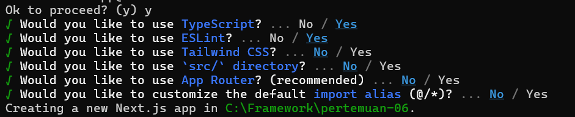
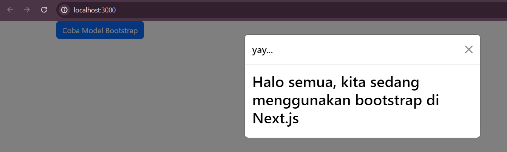
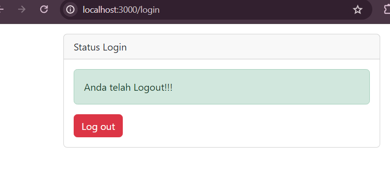
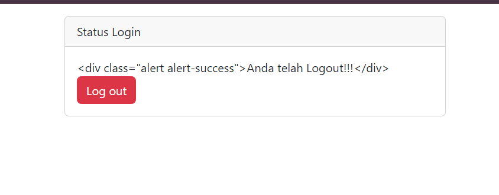

This is a [Next.js](https://nextjs.org/) project bootstrapped with [`create-next-app`](https://github.com/vercel/next.js/tree/canary/packages/create-next-app).

## Getting Started

First, run the development server:

```bash
npm run dev
# or
yarn dev
# or
pnpm dev
# or
bun dev
```

Open [http://localhost:3000](http://localhost:3000) with your browser to see the result.

You can start editing the page by modifying `pages/index.tsx`. The page auto-updates as you edit the file.

[API routes](https://nextjs.org/docs/api-routes/introduction) can be accessed on [http://localhost:3000/api/hello](http://localhost:3000/api/hello). This endpoint can be edited in `pages/api/hello.ts`.

The `pages/api` directory is mapped to `/api/*`. Files in this directory are treated as [API routes](https://nextjs.org/docs/api-routes/introduction) instead of React pages.

This project uses [`next/font`](https://nextjs.org/docs/basic-features/font-optimization) to automatically optimize and load Inter, a custom Google Font.This is a [Next.js](https://nextjs.org/) project bootstrapped with [`create-next-app`](https://github.com/vercel/next.js/tree/canary/packages/create-next-app).

## Getting Started

First, run the development server:

```bash
npm run dev
# or
yarn dev
# or
pnpm dev
# or
bun dev
```

## Laporan Praktikum - 06

|       | Pemrograman Berbasis Framework 2024 |
| ----- | ----------------------------------- |
| NIM   | 2141720222                          |
| Nama  | Diwa Arsyad Atthoriq                |
| Kelas | TI - 3A                             |





## Soal

1. Coba akses http://localhost:3000/login, dan klik tombol login. Kemudian lakukan refresh page berkali-kali (jika perlu restart npm run dev nya). Simpulkan apa yang terjadi ?



Baris 25 dan 30 terdapat method parse(), apa yang terjadi jika kita tidak menggunakan method tersebut?


## 7. Tugas (Pertanyaan Praktikum)

Berdasarkan pada praktikum sebelumnya yang telah dilakukan, beberapa pertanyaan terkait praktikum perlu diselesaikan yaitu sebagai berikut.

1. Apa kegunaan dari kode ini import { useEffect } from "react"; Pada file pages/\_app.tsx? jelaskan
2. Jika pada file pages/\_app.tsx kita tidak menggunakan useEffect (menghapus baris 3, dan baris 9-11, apa yang akan terjadi?
3. Mengapa di react/nextjs penulisan tag html untuk class, harus diganti menjadi className ?
4. Apakah store pada nextjs bisa menyimpan banyak redux reducer?
5. Jelaskan kegunaan dari file store.js!
6. Pada file pages/login.tsx, apa maksud dari kode ini ?
   const { isLogin } = useSelector((state) => state.auth);
7. Pada file pages/counter.tsx, apa maksud dari kode ini?
   const {totalCounter} = useSelector((state) => state.counter);

## Jawab

1. useEffect adalah hook dari React yang memungkinkan Anda menjalankan efek samping pada komponen fungsional. Dalam konteks file pages/\_app.tsx di Next.js, useEffect biasanya digunakan untuk melakukan operasi yang berkaitan dengan lifecycle komponen seperti fetching data, setting up subscriptions, atau manipulasi DOM yang tidak bisa dilakukan di dalam render.

2. Efek samping yang seharusnya dijalankan di dalam useEffect tersebut tidak akan terjadi. Contoh yang sering terjadi adalah operasi inisialisasi, pengambilan data awal, atau setup event listener yang akan dihilangkan. Ini dapat menyebabkan aplikasi tidak berfungsi sesuai harapan atau tidak melakukan inisialisasi yang diperlukan.

3. Di React, atribut class pada elemen HTML harus ditulis sebagai className karena class adalah kata kunci yang sudah digunakan dalam JavaScript untuk mendefinisikan kelas. className adalah properti yang digunakan oleh React untuk menyetel kelas CSS pada elemen.

4. Ya, store pada Next.js bisa menyimpan banyak Redux reducer. Redux menyediakan fungsi combineReducers yang memungkinkan Anda menggabungkan beberapa reducer menjadi satu root reducer. Ini memungkinkan Anda untuk mengatur state aplikasi dalam beberapa reducer yang terpisah, yang masing-masing mengelola bagian state yang berbeda.

5. File store.js biasanya digunakan untuk mengatur store Redux. Di dalam file ini, Anda mengkonfigurasi store Redux, menggabungkan reducer, dan mengaplikasikan middleware jika diperlukan.

6. Kode ini menggunakan hook useSelector dari React-Redux untuk mengambil nilai isLogin dari state Redux. state.auth mengacu pada bagian state yang dikelola oleh authReducer, dan isLogin adalah properti di dalam state tersebut yang menunjukkan apakah pengguna sedang login atau tidak.

7. Kode ini menggunakan hook useSelector untuk mengambil nilai totalCounter dari state Redux. state.counter mengacu pada bagian state yang dikelola oleh counterReducer, dan totalCounter adalah properti di dalam state tersebut yang mencatat jumlah total counter.
